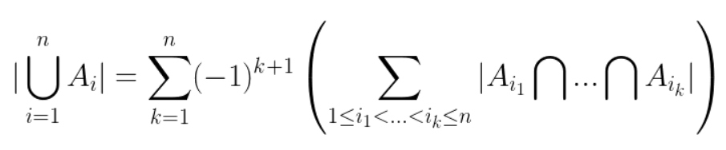

## 一、容斥原理的描述
* **容斥原理** 是一种非常重要的组合数学思想，多用于求解 **任意大小的集合** 或计算 **复合事件的概率** 。可以描述为：要计算几个集合的并集大小，首先对单个集合大小求和，再减去2集合相交部分之和，再加上3个集合相交部分之和，依次类推直到计算所有集合的相交部分为止。 **容斥原理公式** 如下：

## 一、容斥原理的简单应用
### 1.  排列问题
* 数字0-9的数字组成排列，第1个数大于1，最后一个数小于8，求排列数。
答：先转换为 **逆问题** ：首元素≤1或尾元素≥8。设前者排列数为X，后者排列数为Y，则答案为`|X| + |Y| - |X ∩ Y|`，即`tmp = 2 * 9! + 2 * 9! - 4 * 8!`。再由全排列减去即可得到答案`res = 10! - tmp`。

### 2. (0, 1, 2) 序列问题
* 长度为n的012组成的序列，问每个数字都至少出现一次的不同序列个数。
答：同样转换为逆问题，用所有情况减去有数字不出现的情况数。显然1个不出现为`3 * 2^n`，2个不出现为`3 * 1`，三个不出现不存在。则答案为`res = 3^n - 3 * 2^n + 3`

### 3. 方程整数解问题
* 6个数的和为20，范围`[0, 8]`，求解的组数。
答：先考虑所有非负整数解，利用 **隔板法** ，不是 ~~(C_19 ^5)~~ 而是`C_25 ^5`，因为某个数为0可以视为隔板覆盖在该位置，所以隔板可放25处。

