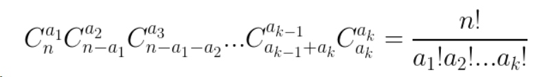
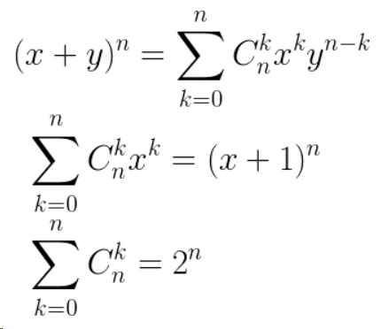
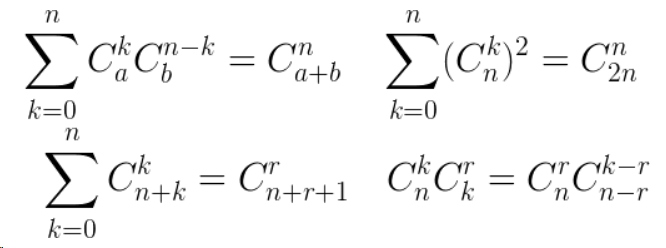
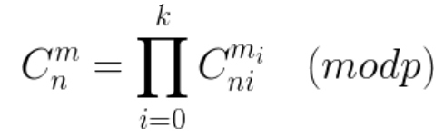

## 一、排列组合基础
1. n个人分成k组，求每组至少有一人的方案数。/ 求k元1次方程组`x1 + x2... + xk = n`的正数解的个数。用 **隔板法** 得到答案为 `C[n - 1][k - 1]`。
2. n个人分成k组，第i组有`a[i]`个人的方案数：

3. n个不同物体中， **可重复** 的选取k个物体的方案数为 `C[n - k + 1][k]`。
4. **圆周排列** ： n个物体选k个排列，其中首尾相连，方案数为`(A[n][k]) / k`。
5. **项链排列** ： 在圆周排列的基础上，视正面向上与反面向上的排列为同一排列，则方案数为`(A[n][k]) / (2 * k)`。

## 二、常用定理
### 1. 二项式定理
* 二项式定理描述了二项式的幂的代数展开，**二项式恒等式** 如下：

* 常见的能由二项式定理推出的 **组合恒等式** 如下：

### 2. Lucas定理
* 对于非负整数n,m和质数p有：

* 其中ni, mi分别表示该数在p进制下第i位数（共k位）

### 3. 鸽巢原理
* 若`n+1`个鸽手说它在前n天比赛的某天要鸽，则至少有一天有两个及以上鸽手要鸽。
* 若`kn + 1`个鸽手说它在前n天比赛的某天要鸽，则至少有一天有两个及以上鸽手要鸽。
* 令`x1, x2..xn`为正整数，若有`sigma_{i=1}^{n} xi + 1`个鸽手说要在前n天的某天要鸽，则至少有一天满足第i天至少有`xi + 1`个鸽手要鸽。

### 4. Ramsey定理
* **图论** 中：对于有n个顶点的 **无权无向图** ，至少有k个 **团** （顶点两两相邻）或l个 **独立集** （顶点两两不相邻），满足这一性质的最小自然数n称为 **拉姆奇数** ，记为`R(k, l)`。
* **着色理论** 中：在有n个顶点的 **完全图** 中所有边分别染上蓝色或红色后，存在k阶子完全图的边都是蓝色 或 存在l阶子完全图的边都是红色，满足条件的最小数n为一个 **拉姆齐数** 。
* 在`icpc`中只需了解：`r(1, m) = 1，r(2, m) = m，r(3, 3) = 6，r(4, 4) = 18`

