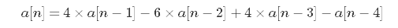
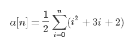
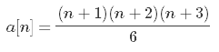

* **前言**：不少数论题常见套路是：`打表 + 找规律`，找规律一般归结为数列问题。若能找出`a[n]`与前若干项的关系，则可以用 **矩阵快速幂** 以`O(logn)`的复杂度求解。若能找出 **通向公式**，则能用`O(1)`的复杂度求解。

## 一、常见数列
1. **a[n] = n ^ 2**

其前n项和`s[n] = n * (n+1) * (2*n+1) / 6`

2. **a[n] = n ^ 3**

其前n项和`s[n] = n^2 * (n+1)^2 / 4`

3. **等差数列**

等差数列对于递推式 **a[n] - a[n-1] = d, n > 1** 恒成立。

`a[n] = a[1] + (n-1) * d`
`s[n] = n * a[1] + n * (n-1) * d / 2`
`s[n] = n * (a[1]+a[n]) / 2`

4. **等比数列**

等比数列对于递推式 **a[n] / a[n-1] = q, n > 1** 恒成立。

`a[n] = a[1] * q^(n-1)`
`s[n] = n * a[1], q = 1`
`s[n] = a[1] * (1 - q^n) / (1 - q), q ≠ 1`

## 二、通项公式的几种求法

1. **累加法**

若能找出关系式`a[n] - a[n-1] = f(n)`则可以用累加法求得通项公式。

```
a[n] - a[n-1] = f(n)
a[n-1] - a[n-2] = f(n-1)
......
a[3] - a[1] = f(3)
a[2] - a[1] = f(2)
```

两边求和得：**a[n] - [1] = S(f(n)) - f(1)** 由于`f(n)`是等差数列，继而容易得出`a[n]`的通项公式

2. **累乘法**

找出关系式`a[n] / a[n-1] = f(n)`则列出n个式子两边累乘即可，原理同上。

3. **迭代法**

找出关系式`a[n] = q * a[n-1] + d`, 依次展开即可：

```
a[n] = q * a[n-1] + d
= q^2 * a[n-2] + d * (1 + q)
= q^3 * a[n-3] + d * (1 + q + q^2)
......
= q^(n-1) * a[1] + d * (1 - q^(n-1)) / (1 - q)
```

## 三、引例

* 求在三维空间中，平面x=0, y=0, z=0, x+y+z=n围成的三棱锥中整点的数目对mod取模。

### 思路一：

暴力打表出前7项：`a[] = {1,4,10,20,35,56,84}`。

设`b[n] = a[n+1] - a[n]`,则`b[n] = {3,6,10,15,21,28,36}`。

设`c[n] = b[n+1] - b[n]`,则`c[n] = {3,4,5,6,7,8,9}`。

显然 **c[n] = n + 3**, 下标从0开始。继而得到 **(a[n+2] - a[n+1]) - (a[n+1] - a[n]) = n + 3**, 即 `a[n] - 2*a[n-1] + a[n-2] = n + 1`。错位相减得到`a[n] - 3*a[n-1] + 3*a[n-2] - a[n-3] = 1`, 继续错位相减得到以下递推式：

<p style="text-align:center"></p>

从而利用 **矩阵快速幂** 求解即可，复杂度为`O(logn)`。

### 思路二：

不难得出在二维平面中的整点数目为`b[n] = (n+1) * (n+2) / 2 = (n^2 + 3*n + 2)`。而引申到三维中即为(n+1)个二维整点数的和，表示为:

<p style="text-align:center"></p>

又已知`c[n] = n^2`的前n项和为`s[n] = n * (n+1) * (2*n+1) / 6`,可得出a[n]的通项公式：

<p style="text-align:center"></p>

从而可以用复杂度为`O(1)`的算法得出答案。

## 四、模板题

[来源：hdu #6185](http://acm.hdu.edu.cn/showproblem.php?pid=6185)

题目大意：求用1*2和2*1的格子去覆盖4*n的矩阵的方案数。

```c++
#include<bits/stdc++.h>

using namespace std;
typedef long long LL;

const int mod = int(1e9+7);
const LL ans[] = {1,5,11,36};        //前4项
const LL base[] = {0,1,0,0,0,0,1,0,0,0,0,1,-1,1,5,1}; //变换矩阵
//公式 a[i] = a[i-1] + 5 * a[i-2] + a[i-3] - a[i-4] 对应变换矩阵的最后一行-1,1,5,1
const int Size = 4;
LL n;

struct matrix{

    LL a[Size][Size];
    matrix(){           //默认为单位矩阵
        memset(a,0,sizeof(a));
        for(int i = 0; i < Size; i++) a[i][i] = 1;
    }
    matrix(const LL t[]){   //变换矩阵
        for(int i = 0, f = 0; i < Size; i++)
            for(int j = 0; j < Size; j++)
                a[i][j] = t[f++];
    }
    matrix operator*(matrix t){ //矩阵乘法
        matrix res;
        for(int i = 0; i < Size; i++)
            for(int j = 0;j < Size; j++){
                res.a[i][j] = 0;
                for(int k = 0; k < Size; k++)
                    res.a[i][j] = (res.a[i][j] + (a[i][k] * t.a[k][j]) % mod) % mod;
            }
        return res;
    }
};
matrix mod_pow(matrix x,LL n){      //矩阵快速幂

    matrix res;
    while(n){
        if(n & 1) res = res * x;
        n >>= 1;
        x = x * x;
    }
    return res;
}
void solve(){

    if(n <= Size){
        cout<<ans[n-1]<<endl;
        return;
    }
    LL res = 0;
    matrix tt = mod_pow(matrix(base),n - Size);
    for(int i = 0; i < Size; i++) (res += tt.a[Size-1][i] * ans[i] % mod) %= mod;
    cout<<(res + mod) % mod<<endl;
}
int main(){

    while(cin>>n) solve();

//    system("pause");
    return 0;
}
```
