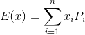

## 一、概率论
* **全概率公式**

    设事件组 `A1,A2...An`是样本空间`Ω`的一个划分，且两两互斥。则可以把事件B划分成n个小事件，将所有Ai发生情况下B发生的概率求和，即可求出B事件发生的概率。
    <br><p style="text-align:center"></p>

* **贝叶斯公式**

    在大事件B发生的情况下求Ai发生的原因，结果为Ai发生下B发生的概率除以所有A发生下B发生的概率，又称为后验概率。
    <br><p style="text-align:center"></p>

* **离散性数学期望**

    设随机变量x的取值为`x1,x2...xn`，对应取值概率为`p1,p2...pn`，则x的期望：
    <br><p style="text-align:center"></p>

* **连续型数学期望**
    设`f(x)`为随机变量x的概率密度函数，若积分绝对收敛，则x的期望：
    <br><p style="text-align:center"></p>

## 二、微积分
**simpson算法** 可以以较小的误差求出定积分。simpson公式如下，为了增加精度，用二分法不断迭代细化。
<br><p style="text-align:center"></p>

```c++
const double eps =1e-10;
double f(double x){    //待积分的函数

    return x;
}
double simpson(double l,double r){  //simpson公式

    return (f(l)+4*f((l+r)/2)+f(r))/6*(r-l);
}
double integral(double l,double r){ //求f(x)在区间[l,r]上的定积分

    double mid=(l+r)/2.0;
    double res=simpson(l,r);
    if(fabs(res-simpson(l,mid)-simpson(mid,r))<eps) return res;
    return integral(l,mid)+integral(mid,r);
}
```


