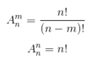

## 一、阶乘
*  **威尔逊定理** 若p为素数，则 `(p-1)! ≡ -1 (mod p)` 恒成立。
n的阶乘对p取模可以表示为`n! = a p^e = a mod p` 。能被p整除的项为`p,2p,3p...`，同除p得到`1,2,3...`，预处理1~p的阶乘表即可。易知不能被p整除的项在mod p下呈周期性，所以不能被p整除的项的积等于`(p-1)!^(n/p) * (n mod p)!`。具体实现如下：

```c++
const int p=997;
int fact[p];
void ini(){     //预处理0~p-1的 i! (mod p)

    fact[0]=fact[1]=1;
    for(int i=2;i<p;i++)
        fact[i]=fact[i-1]*i%p;
}
int mod_fact(int n,int &e){   //计算 n! (mod p)

    //n!分解为ap^e,返回a%p
    e=0;
    if(!n) return 1;
    int res=mod_fact(n/p,e);  //计算p的倍数部分
    e+=n/p;

    if((n/p)%2) return res*(p-fact[n%p])%p;
    return res*fact[n%p]%p;
}
```

## 二、Catalan数
* Catalan数时组合数学中一个常用在各种计数问题中出现的数列，令`h(0) = 1 , h(1) = 1`，则catalan数满足如下通项公式和递推公式：
<br>

其常见应用如下：
1. **出栈次序** `一个栈的进栈序列为1、2、3...n，求出栈序列的方案数。`
2. **括号匹配** `给定n对括号，求满足正确配对的字符串个数。`
3. **构成二叉树** `给定n个节点，求能构成的二叉树的方案数。`
4. **凸多边形三角划分** `给定凸的n边形，用n-3条不相交的对角线划分成n-2个三角形，求方案数。`

## 三、 排列数
* **排列数公式**
<br>

* **有重复元素的全排列**
 给定k个元素，第i个元素有ni个元素，则全排列的个数为：总个数和的阶乘（除以）各元素阶乘的积。
<br><p style="text-align:center"></p>

## 四、组合数
* **可重复选择的组合**
给定n个不同元素，选出k个元素（可重复选），则选法个数为：
<br><p style="text-align:center"></p>

*  **组合数递推式**
从n个数中选0个数有1种方案，然后利用如下递推公式，可得从n个数中选k个数的方案数：
<br><p style="text-align:center"> </p>

* **组合数打表**
由于组合数和 **杨辉三角** 有着紧密的联系，所以可以利用递推式 `c[n][i]=c[n-1][i]+c[n-1][i-1]` 进行打表：
```c++
const int maxn=1001;
const int mod=100;
int c[maxn][maxn];
void ini(){

    for(int n=0;n<maxn;n++){
        c[n][0]=c[n][n]=1;
        for(int i=1;i<n;i++)
            c[n][i]=(c[n-1][i]+c[n-1][i-1])%mod;
    }
}
```
* **大组合数 C(n)(m) mod p** 
把组合数写成阶乘的积的形式，即可快速求出大组合数对p取模。实现如下：
```c++
void extgcd(int a,int b,int &x,int &y){

    b?(extgcd(b,a%b,y,x),y-=(a/b)*x):(x=1,y=0);
}
int ni(int a,int m){       //利用extgcd求a模m的逆元

    int x,y;
    extgcd(a,m,x,y);
    return (m+x%m)%m;
}
int C(int n,int m){

    if(n<0||m<0||n<m) return 0;
    int e1,e2,e3;   //写成阶乘的分解形式,mod_fact写法见上
    int a1=mod_fact(n,e1);
    int a2=mod_fact(m,e2);
    int a3=mod_fact(n-m,e3);
    if(e1>e2+e3) return 0;
    return a1*ni(a2*a3%p,p)%p;
}
```
