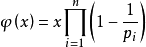

##  一、同余定理
如果两个整数a,b对整数m同余，即(a mod m)等于(b mod m)，((a-b) mod m)等于0，则称a与b对模m同余，记作`a ≡ b ( mod m )`。
## 二、费马-欧拉定理
* **费马小定理** 若x为整数，p为素数，且x和p互质，则 `x^(p-1) = 1 (mod p)`恒成立。
* **欧拉定理** 如果a,m为整数，且a和m互质，则a的φ(m)次方对m取模恒等于1，记作 `a^φ(m) ≡ 1（mod m）`。其中φ(m)为m的欧拉函数，表示小于m的正整数中与m互质的数的个数。
* 当m为质数时，φ(m)=m-1，所以此时 `a^(m-1) ≡ 1（mod m）`。可以说欧拉定理是费马小定理的拓展。
## 三、欧拉函数
对于正整数x，小于x的正整数中与n互质的数的个数为x的欧拉函数，记为`φ(x)`。欧拉函数具有如下通项公式：
<p style="text-align:center"></p>

* **第n个欧拉函数**
根据通项公式，第n个欧拉函数求法如下，复杂度为`O(sqrt(n))`。
```c++
typedef long long LL;
LL eular(LL n){

    LL res=n;
    for(int i=2;i*i<=n;i++)
        if(n%i==0){
            res-=res/i;
            while(n%i==0) n/=i;
        }
    if(n>1) res-=res/n;
    return res;
}
```
* **欧拉函数表**

1. 利用 **埃拉托斯特尼筛法** 打出1~n的欧拉函数表，实现如下：
```c++
const int maxn=1e6;
int phi[maxn];
void getlist(){

    for(int i=0;i<maxn;i++) phi[i]=i;
    for(int i=2;i<maxn;i++)
        if(phi[i]==i){
            for(int j=i;j<maxn;j+=i) phi[j]-=phi[j]/i;
        }
}
```
2. 利用 **欧拉筛法** 和 **莫比乌斯反演**，可以在`O(n)`时间内打出 **欧拉函数表** 和 **素数表** 。<a href="https://github.com/KingJoySaiy/R.O.D./blob/master/Number%20Theory/莫比乌斯反演.md">见《莫比乌斯反演》第四段</a>
## 四、数论阶
### 1、定义
在(a,m)=1的整数集中，任意n都满足`a^n ≡ 1 (mod m)`，则满足条件的最小整数r为a模m的阶。
也就是说，满足a的n次方除以m余1的最小n是a模m的阶。记作`ord_m(a)`。
### 2、求数论阶的方法
 先对m分解因子，设`m=p1^r1*p2^r2…pk^rk `，然后将ri逐个相减并记为p，直到再减一个之后`a^p≠1(mod m)`。此时p即为a模m的阶。

* φ(m)恒为ord_m(a)的整数倍，记作`ord_m(a)|φ(m)`。
* `a^x ≡ 1 (mod m)`等价于`ord_m(a) | x`。
* `a^x ≡ a^y ( mod m)`等价于`x ≡ y ( mod ord_m(a) )`。 
## 五、原根
### 1、定义
如果1<g<p，且对于任意满足1<i<p的整数i，(g^i mod p)结果两两不同，则g是p的原根。也就是说，枚举1<g<p，当`g^(p-1) =1 (mod p) `仅有唯一解p-1时成立，则g是p的原根。
当p为素数时，由于`ord_m(a)<=φ(m)`，则当`ord_m(a)=φ(m)`时，a是m的原根。
## 2、求原根的方法
先对φ(p)分解因子`φ(p)=p1^r1*p2^r2…pk^rk`，若`g^( φ(p)/p_i ) ≠ 1 (mod p) `恒成立，则g为p的原根。当p为质数时`φ(p) = p-1` 带入即可。
* m（若存在）的原根数目为 **φ(φ(m))** 。
* m有原根的充要条件：`m = 2, 4, p^n, 2p^n`，其中p为奇质数，n为任意正整数。

## 六、模板题（原根）
<a href="https://www.51nod.com/onlineJudge/questionCode.html#!problemId=1135">来源：51nod #1135</a><br>

题目大意：设m是正整数，a是整数，若a模m的阶等于φ(m)，则称a为模m的一个原根。给出1个质数P，找出P最小的原根。
```c++
#include <iostream>
#include <algorithm>
#include <bitset>
using namespace std;
typedef long long LL;

const int maxn =1e6+5;
int prime[maxn],p;//存储素数
int a[maxn],n;//存储因子
bitset<maxn> t;

void init(){    //埃氏筛法枚举素数

    t.set();    //将所有二进制数都标为1
    for(int i=2;i<maxn;i++){
        if(t[i]){
            prime[p++]=i;
            for(int j=i+i;j<maxn;j+=i) t[j]=0;
        }
    }
}
void divide(int x){//将x分解因子

    n=0;
    int nn=(int)sqrt(x);
    for(int i=0;prime[i]<=nn;i++){
        if(x%prime[i]==0) {
            a[n++] = prime[i];
            while (x % prime[i] == 0) x /= prime[i];//处理多个相同因子的情况
        }
    }
    if(x>1) a[n++]=x;
}
LL pow_mod(LL x,LL n,LL mod){//快速幂运算

    LL res=1;
    while(n>0){
        if(n&1) res=res*x%mod;
        x=x*x%mod;
        n>>=1;
    }
    return res;
}
void solve(int x){

    divide(x-1);
    for(int g=2;g<x;g++){
        bool flag=true;
        for(int i=0;i<n;i++) {
            int tt=(x-1)/a[i];
            if (pow_mod(g, tt, x) == 1) {
                flag = false;   //若有一个取模为1，则不满足条件
                break;
            }
        }
        if(flag){
            cout<<g<<endl;
            break;
        }
    }
}
int main() {

    init(); //初始化
    int x;
    while(cin>>x) solve(x);

    return 0;
}
```


