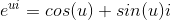
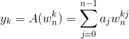
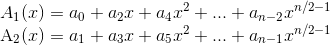
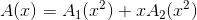

## 一、霍纳法则
给定`f(x) = a0 + a1x + a2x^2 + a3x^3... + anx^n`，对于 **多项式求值问题** ，常规思路是每一项求值然后累加，但时空复杂度较高。而 **霍纳法则** 可以在`O(n)`时间复杂度内完成求值运算。
公式为：`f(x) = a0 + x ( a1 + x ( a2+...+x( an-1+x(an) ) ) )`。模版如下：
```c++
#include<bits/stdc++.h>
using namespace std;
const int maxn=100;
double a[maxn];
int n;
double Horner(double x){    //f(x)=a0+a1x+a2x^2+a3x^3...+anx^n

    double res=0;
    for(int i=n;i>=0;i--) res=x*res+a[i];
    return res;
}
int main() {

    double x0;
    cin>>n;
    for(int i=0;i<=n;i++) cin>>a[i];
    cin>>x0;
    for(int i=n;i>=0;i--){
        if(i!=n) cout<<" + ";
        cout<<a[i]<<"*x^"<<i;
    }
    cout<<" = "<<Horner(x0)<<endl;

    return 0;
}
```
## 二、单位复数根
* 定义：n次单位复数根是满足`w^n = 1`的复数w，n次单位复数根恰好有n个。对于`k = 0,1,2...n-1`，这些根是`e^(2πk/n i)`，复数的指数形式定义为：
  
<br>
例如3次单位复数根如下：

<br>
单位复数根具有如下性质：
1. （消去引理）对于任意非负整数n,k，以及正数d，总有第dk个dn次单位复数根等于第k个n次单位复数根，即`w_(dn) (dk) = w_(n) k`。
2. （折半引理）若n为正偶数，则n个n次单位复数根的平方的集合是n/2个n/2次单位复数根的集合，即`( w_(n) k )^2 = w_(n/2) k`。
3. （求和引理）对任意正整数n个不能被n整出的非负整数k，有`∑_(j=0)(n-1) (w_n k)^j = 0`。
## 三、离散傅立叶（DFT）
对于多项式的 **系数表达式** `f(x) = a0 + a1x + a2x^2 + a3x^3... + anx^n`，记`yk = f(xk)`，则多项式可写成`{ (x0,y0)，(x1,y1)...(xn-1,yn-1) }`，该式称为 **点值表达式** 。
在DFT变换中，希望计算多项式A(x)在满足`w^n = 1`的所有单位复数根处的值，也就是求：

<br>
称向量`y=(y0,y1...yn-1)`为系数向量`a = (a0,a1...an-1)`的离散傅立叶变换，记为`y = DFT_n(a)`。
## 四、快速傅立叶（FFT）
对于两个多项式的乘法运算，DFT的复杂度是`O(n^2)`， 而利用复数根的特殊性质的话, 可以在O(nlogn)的时间内完成，FFT采用分治的思想，`A1(x)`和`A2(x)`，公式如下：

<br>
从而得出`A(x)`与其对应关系：

<br>
从而只要求出次数界是`n/2`的多项式`A1(x)`和`A(x)`在n个n次单位复数根的平方处的取值即可。从而递归后规模缩减一半，当前问题可以在两个子问题次数之和的复杂度内解决，复杂度为`O(nlogn)`。

## 五、模版题（FFT）
<a href ="http://acm.hdu.edu.cn/showproblem.php?pid=1402">来源：hdu #1402</a><br>
题目大意：给出两个大整数，求二者的乘积。
```c++
#include <bits/stdc++.h>
using namespace std;
const double PI = acos(-1.0);
const int MAXN = 200010;

string str1,str2;
int sum[MAXN];

class Complex{      //复数结构体
public:
    double x,y;     //实部和虚部 x+yi
    Complex(double _x = 0,double _y = 0):x(_x),y(_y){}
    Complex operator -(const Complex &b)const {
        return Complex(x-b.x,y-b.y);
    }
    Complex operator +(const Complex &b)const {
        return Complex(x+b.x,y+b.y);
    }
    Complex operator *(const Complex &b)const {
        return Complex(x*b.x-y*b.y,x*b.y+y*b.x);
    }
}x1[MAXN],x2[MAXN];

//进行FFT和IFFT前的反转变换。
//位置i和 （i二进制反转后位置）互换。len必须去2的幂
void change(Complex y[],int len) {

    for(int i=1,j=len/2,k;i<len-1;i++){
        if(i<j) swap(y[i],y[j]);
    //交换互为小标反转的元素，i<j保证交换一次
    //i做正常的+1，j左反转类型的+1,始终保持i和j是反转的
        k=len/2;
        while(j>=k) {
            j-=k;
            k/=2;
        }
        if(j<k) j+=k;
    }
}
//len必须为2^k形式,on==1时是DFT，on==-1时是IDFT
void fft(Complex y[],int len,int on) {

    change(y,len);
    for(int h=2;h<=len;h<<=1){
        Complex wn(cos(-on*2*PI/h),sin(-on*2*PI/h));
        for(int j=0;j<len;j+=h){
            Complex w(1,0);
            for(int k=j;k<j+h/2;k++) {
                Complex u=y[k];
                Complex t=w*y[k+h/2];
                y[k]=u+t;
                y[k+h/2]=u-t;
                w=w*wn;
            }
        }
    }
    if(on==-1){
        for(int i=0;i<len;i++) y[i].x/=len;
    }
}
int main(){

    while(cin>>str1>>str2) {
        int len1=str1.length(),len2=str2.length(),len=1;
        while(len<len1*2||len<len2*2) len<<=1;
        
        for(int i=len1-1;i>=0;i--) x1[i]=Complex(str1[i]-'0',0);
        for(int i=len1;i<len;i++) x1[i]=Complex(0,0);

        for(int i=len2-1;i>=0;i--) x2[i]=Complex(str2[i]-'0',0);
        for(int i=len2;i<len;i++) x2[i]=Complex(0,0);

        //求DFT
        fft(x1,len,1);
        fft(x2,len,1);
        for(int i=0;i<len;i++) x1[i]=x1[i]*x2[i];
        fft(x1,len,-1);
        for(int i=0;i<len;i++) sum[i]=int(x1[i].x+0.5);
        for(int i=0;i<len;i++){
            sum[i+1]+=sum[i]/10;
            sum[i]%=10;
        }
        len=len1+len2-1;
        while(sum[len]<=0&&len>0) len--;
        for (int i=len;i>=0;i--) printf("%c",sum[i]+'0');
        puts("");
    }

    return 0;
}
```