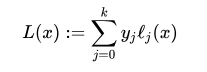
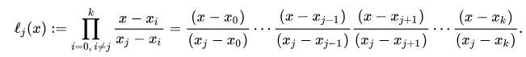

## 一、拉格朗日插值多项式
* 定义：在 **数值分析** 中， **拉格朗日插值法** 一般用于根据函数中若干点`(x, y)`值得到一个多项式，求出某横坐标处对应的数值。

1. 要解一个n次多项式(算上常数项共`n + 1`项)，需要`n + 1`个点值而列出方程组。根据 **线性代数** 的知识，若方程有唯一解，则该方程组必须是 **非齐次线性方程组** (或称 **矩阵的秩** 为 `n + 1`)。
2. 设已知`k + 1`个取值点`(x0, y0),(x1, y1)...(xk, yk)`满足x互不相等。则 **拉格朗日插值多项式** 为：

3. 其中`l_j(x)`为 **拉格朗日基本多项式** （或称 **插值基函数** ），其表达式为：

## 二、k次幂前缀和