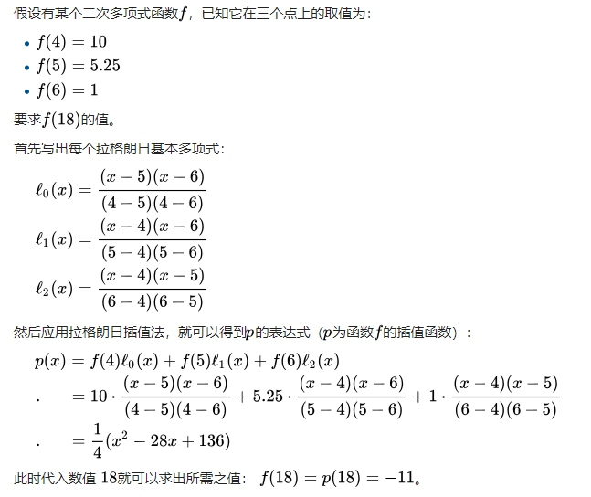
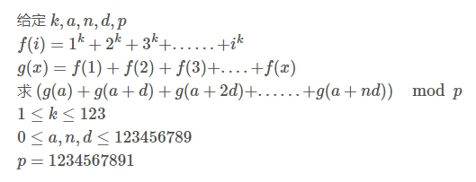

## 一、拉格朗日插值多项式
* 定义：在 **数值分析** 中， **拉格朗日插值法** 一般用于根据函数中若干点`(x, y)`值得到一个多项式，求出某横坐标处对应的数值。

1. 要解一个n次多项式(算上常数项共`n + 1`项)，需要`n + 1`个点值而列出方程组。根据 **线性代数** 的知识，若方程有唯一解，则该方程组必须是 **非齐次线性方程组** (或称 **矩阵的秩** 为 `n + 1`)。
2. 设已知`k + 1`个取值点`(x0, y0),(x1, y1)...(xk, yk)`满足x互不相等。则 **拉格朗日插值多项式** 为：


3. 其中`l_j(x)`为 **拉格朗日基本多项式** （或称 **插值基函数** ），其表达式为：


4. 一个来自 **wikipedia** 的范例：



## 二、模板题（拉格朗日插值）
[来源：bzoj #3453](https://www.lydsy.com/JudgeOnline/problemset.php) （ bzoj凉了，这题也炸了，啊不过这不重要 ） 题意如图：



1. 对于函数g作`k + 3`次差分运算后其项为0，所以g最高次项为`k + 2`。设答案为`f(n)`表示与n相关的前缀和，对f作`k + 5`次差分运算后其项为0，所以f最高次项为`k + 4`。
2. 由于k数据范围较小，可以求2次前缀和`O(klogk)`时间得到`1 ~ k + 3`函数g的表。
3. 然后每次选区函数g的前`k + 3`个数，用拉格朗日插值法得到相应的第`a + i * d`项数即可求出函数f的前`k + 5`项。再用一次拉格朗日插值法，选取这些数即可求出第n个前缀和，即为答案。

```c++
#include <bits/stdc++.h>

using namespace std;
typedef long long LL;

const int mod = 1234567891;
const int maxk = 130;

LL a, n, d;
LL g[maxk], f[maxk];
int ct, k;

LL mod_pow(LL x, LL n) {

    LL res = 1;
    while (n) {
        if (n & 1) res = res * x % mod;
        x = x * x % mod;
        n >>= 1;
    }
    return res;
}
inline LL Lagrange(LL *a, int n, LL pos) {  //对于函数a，已知前1~n项，求第pos项

    if (pos <= n) return a[pos];
    LL res = 0;
    for (int i = 1; i <= n; i++) {
        LL s1 = 1, s2 = 1;      //s1分子, s2分母(逆元)
        for (int j = 1; j <= n; j++) {
            if (i != j) {
                (s1 *= (pos - j)) %= mod;
                (s2 *= (i - j)) %= mod;
            }
        }
        (res += a[i] * s1 % mod * mod_pow(s2, mod - 2)) %= mod;
    }
    return res;
}
void solve() {

    cin >> k >> a >> n >> d;
    for (int i = 1; i <= k + 3; i++) g[i] = mod_pow(i, k);   //O(klogk)得到g函数表
    for (int i = 2; i <= k + 3; i++) (g[i] += g[i - 1]) %= mod;
    for (int i = 2; i <= k + 3; i++) (g[i] += g[i - 1]) %= mod;

    f[0] = Lagrange(g, k + 3, a);
    for (int i = 1; i <= k + 5; i++) {
        f[i] = (Lagrange(g, k + 3, (i * d + a) % mod) + f[i - 1]) % mod;
    }
    cout << (Lagrange(f, k + 5, n) + mod) % mod << endl;
}
int main() {    //预先打出函数g的表，逆元表，素数处的k次幂表（用线性筛）会更快些

    ios::sync_with_stdio(false), cin.tie(nullptr), cout.tie(nullptr);
    cin >> ct;
    while (ct--) solve();

    return 0;
}
```

