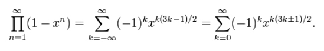
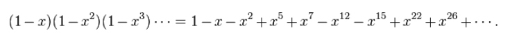
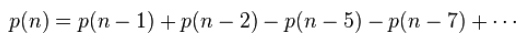

## 一、五边形定理
**五边形数** 是指能按如下规则排成五边形的端点数，易知第n个五边形数：`p(n) = (3*n^2-n) / 2 `，其中n为正整数。
**广义五边形数** 定义n的取值为`0,1,-1,2,-2,3,-3....`。

**五边形数定理** 是一个由欧拉发现的数学定理，描述欧拉函数展开式的特性。欧拉函数的展开式如下：


欧拉函数展开后，有些方项呗消去，只留下方项为`1,2,5,7,12...`的项次，留下来的次方恰为广义五边形数。
## 二、整数拆分
* 欧拉函数的倒数是 **分割函数** 的母函数，即：
<br>
此式代入五边形定理公式，得到：
<br>
考虑x^n项的系数，当n>0时，等式右侧的系数均为0，比较等式两侧的系数，可得到分割函数p(n)的递归式：
<br><br>
通过该递归式，可以快速的计算n的整数划分方案数p(n)，模版如下：
```c++
const int mod=1e9+7;
const int maxn=1e5+5;
int dp[maxn];     //动规记录拆分方案数
void chaifen(){

    memset(dp,0,sizeof(dp));
    dp[0]=1;
    for(int i=1;i<maxn;i++)
        for(int j=1,r=1;i-(3*j*j-j)/2>=0;j++,r*=-1){   //加上广义五边形数
            dp[i]=(dp[i]+dp[i-(3*j*j-j)/2]*r)%mod;
            dp[i]=(dp[i]+mod)%mod;
            if(i-(3*j*j+j)/2>=0){
                dp[i]=(dp[i]+dp[i-(3*j*j+j)/2]*r)%mod;
                dp[i]=(dp[i]+mod)%mod;
            }
        }
}
```
## 三、条件拆分
当整数拆分加上了限制条件（每个数出现次数不大于k）后，则在原先动规结果的基础上，要用生成函数得出最终解。原理是针对`dp[n]`加上所有满足`n-k*(3j^2-j)/2≥0`的所有函数值并取模。
## 四、模版题（条件拆分）
<a href="http://acm.hdu.edu.cn/showproblem.php?pid=4658">来源：hdu #4658</a>
题目大意：给定若干正整数，求其拆分方案数对(1e9+7)取模，要求相同数不超过k个。
```c++
#include <bits/stdc++.h>
using namespace std;
const int mod=int(1e9+7);
const int maxn=int(1e5+5);
int dp[maxn];     //动规记录拆分方案数

void chaifen(){

    memset(dp,0,sizeof(dp));
    dp[0]=1;
    for(int i=1;i<maxn;i++)
        for(int j=1,r=1;i-(3*j*j-j)/2>=0;j++,r*=-1){   //加上广义五边形数
            dp[i]=(dp[i]+dp[i-(3*j*j-j)/2]*r)%mod;
            dp[i]=(dp[i]+mod)%mod;
            if(i-(3*j*j+j)/2>=0){
                dp[i]=(dp[i]+dp[i-(3*j*j+j)/2]*r)%mod;
                dp[i]=(dp[i]+mod)%mod;
            }
        }
}
int solve(){     //生成函数

    int n,k;
    scanf("%d%d",&n,&k);
    int res=dp[n];
    for(int j=1,r=-1;n-k*(3*j*j-j)/2>=0;j++,r*=-1){
        res=(res+dp[n-k*(3*j*j-j)/2]*r)%mod;
        res=(res+mod)%mod;
        if(n-k*(3*j*j+j)/2>=0){
            res=(res+dp[n-k*(3*j*j+j)/2]*r)%mod;
            res=(res+mod)%mod;
        }
    }
    printf("%d\n",res);
}
int main(){

    chaifen();
    int ct;
    cin>>ct;
    while(ct--) solve();

    return 0;
}

```