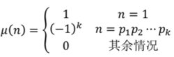
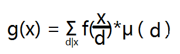

## 一、莫比乌斯函数
莫比乌斯函数是一个数论函数，同时也是一个 **积性函数** ，用`μ(n)表示`。把自变量n分解，表示为`n=p1*p2...*pk`，其中p集为互不相同的质数，给出如下表达：

```c++
const int maxn = 1e6;
bool check[maxn+5];
int prime[maxn+5],tot; //记录素数
int mu[maxn+5];        //记录mobius函数
void Moblus() {

    memset(check,false,sizeof(check));
    mu[1] = 1;
    tot = 0;
    for(int i = 2; i <= maxn; i++){
        if( !check[i] ){
            prime[tot++] = i;
            mu[i] = -1;
        }
        for(int j = 0; j < tot; j++){
            if(i * prime[j] > maxn) break;
            check[i * prime[j]] = true;
            if( i % prime[j] == 0) mu[i * prime[j]] = 0;
            else mu[i * prime[j]] = -mu[i];
        }
    }
}
```
## 二、莫比乌斯反演
对于定义在两个正整数集合上的两个函数f(x)与g(x)，满足`f(x) = ∑_(d|n) g(d)`。根据该式，可以发现：


从上面表格里面发现规律，得出g(x)的表达式  ~~（这是显然的，不清楚可以自行脑补)~~：`g(x) = ∑_(d|x) f(d)*μ(x/d)`。通过换元法，另`t=x/d`，则`t|x，x/t=d，x/d=t`，最终得到如下公式：
<br>
## 三、欧拉筛法
有一种叫 **埃拉托斯特尼** 的筛法可以求出1~n内的所有欧拉函数值，复杂度为`O(loglog(n))`，已经很快了，但是 **欧拉筛法** 可以直接把复杂度将为`O(n)`，同时得到素数表，利用的是 **莫比乌斯反演** 的思想。
```c++
const int maxn = 1e6;
bool check[maxn+5];    //标记合数
int phi[maxn+5];       //记录欧拉函数值
int prime[maxn+5],tot; //记录素数
void getlist(int N){

    memset(check,false,sizeof(check));
    phi[1] = 1;
    tot = 0;
    for(int i = 2; i <= N; i++){
        if( !check[i] ){
            prime[tot++] = i;
            phi[i] = i-1;
        }
        for(int j = 0; j < tot; j++){
            if(i * prime[j] > N) break;
            check[i * prime[j]] = true;
            if( i % prime[j] == 0) phi[i * prime[j]] = phi[i] * prime[j];
            else phi[i * prime[j]] = phi[i] * (prime[j] - 1);
        }
    }
}
```
## 四、模版题（Mobius反演）
<a href="http://www.lydsy.com/JudgeOnline/problem.php?id=2301">来源：bzoj #2301</a><br>
题目大意：