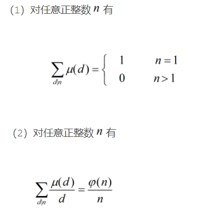

## 一、容斥原理
**容斥原理** 是一种重要的组合数学方法，可以让你求解任意大小的集合，或者计算复合事件的概率。现进行如下描述：
* 要计算几个集合并集的大小，先将所有单个集合的大小计算出来，然后减去所有两个集合相交的部分，再加回所有三个集合相交的部分，再减去所有四个集合相交的部分，依此类推，一直计算到所有集合相交的部分。

例如，`A∪B∪C = A + B + C - A∩B - B∩C - C∩A + A∩B∩C`，用 **韦恩图** 表示一目了然。


## 二、Mobius函数

莫比乌斯函数是一个数论函数，同时也是一个 **积性函数** ，用`μ(n)表示`。把自变量n分解，表示为`n=p1*p2...*pk`，其中p集为互不相同的质数，给出如下表达：


```c++
const int maxn = int(1e6 + 5);
bool book[maxn];
int prime[maxn], tot;       //记录素数
int mu[maxn];               //记录莫比乌斯函数

void Mobius() {

    memset(book, false, sizeof(book));
    mu[1] = 1;
    for (int i = 2; i < maxn; i++) {
        if (!book[i]) {
            prime[tot++] = i;
            mu[i] = -1;
        }
        for (int j = 0; j < tot; j++) {
            if (i * prime[j] >= maxn) break;
            book[i * prime[j]] = true;
            if (i % prime[j] == 0) mu[i * prime[j]] = 0;
            else mu[i * prime[j]] = -mu[i];
        }
    }
}
```

## 三、莫比乌斯反演
对于定义在两个正整数集合上的两个函数f(x)与g(x)，满足`f(x) = ∑_(d|x) g(d)`。根据该式，可以发现：


从上面表格里面发现规律，得出g(x)的表达式  ~~（这是显然的，不清楚可以自行脑补)~~：`g(x) = ∑_(d|x) f(d)*μ(x/d)`。通过换元法，另`t=x/d`，则`t|x，x/t=d，x/d=t`，最终得到如下公式：
[<br>]
* 对于 **欧拉函数** φ(x)，不难证明`x = ∑_(d|x) φ(d)`，相当于给定`f(x) = x`，通过 **莫比乌斯反演** 求得g(x)即为欧拉函数。
* 若g(d)让f(x)为 **积性函数** ，那么g(d)是积性函数。利用这个重要结论可证欧拉函数是积性函数。
* 性质：




## 四、欧拉筛法（线性筛）
**埃拉托斯特尼** 筛法复杂度为`O(loglog(n))`，已经很快了，但是 **欧拉筛法** 可以直接把复杂度将为`O(n)`，同时得到素数表，利用的是 **莫比乌斯反演** 的思想。
```c++
const int maxn = 1e6;
bool check[maxn+5];    //标记合数
int phi[maxn+5];       //记录欧拉函数值
int prime[maxn+5],tot; //记录素数
void getlist(int N){    //打出1-N的欧拉函数表和素数表

    memset(check,false,sizeof(check));
    phi[1]=1;
    tot=0;
    for(int i=2;i<=N;i++){
        if(!check[i]){
            prime[tot++]=i;
            phi[i]=i-1;
        }
        for(int j=0;j<tot;j++){
            if(i*prime[j]>N) break;
            check[i*prime[j]]=true;
            if(i%prime[j]==0) phi[i*prime[j]]=phi[i]*prime[j];
            else phi[i*prime[j]]=phi[i]*(prime[j]-1);
        }
    }
}
```
## 五、模版题（Mobius反演 + 容斥原理）
<a href="http://www.lydsy.com/JudgeOnline/problem.php?id=2301">来源：bzoj #2301</a><br>
题目大意：给定整数a,b,c,d,k，求满足`gcd(x,y) = k (a≤x≤b c≤y≤d)`的整数对x,y的个数。
```c++
#include <bits/stdc++.h>

using namespace std;
typedef long long LL;

const int maxn = int(5e4 + 5);
LL a, b, c, d, k, res, ct;
int prime[maxn], cnt;  //记录质数
bool book[maxn];        //标记合数
int mobius[maxn], sum[maxn];//记录莫比乌斯函数及其前缀和

void init() {

    mobius[1] = 1;
    cnt = 0;
    for (int i = 2; i < maxn; i++) {
        if (!book[i]) {
            prime[cnt++] = i;
            mobius[i] = -1;
        }
        for (int j = 0; j < cnt; j++) {
            if (i * prime[j] >= maxn) break;
            book[i * prime[j]] = true;
            if (i % prime[j] == 0) mobius[i * prime[j]] = 0;
            else mobius[i * prime[j]] = -mobius[i];
        }
    }
    for (int i = 1; i <= maxn; i++) sum[i] = sum[i - 1] + mobius[i];//求莫比乌斯函数的前缀和
}
LL work(LL n, LL m) {       //计算i在[1,n]且j在[1,m]中的gcd(i,j) == k的数目

    if (n > m) swap(n, m);
    n /= k, m /= k;
    if (!n) return 0;
    LL res = 0;
    for (LL i = 1, now; i <= n; i = now + 1) {  //数论分块
        now = min(n / (n / i), m / (m / i));
        res += (sum[now] - sum[i - 1]) * (n / i) * (m / i);
    }
    return res;
}
int main() {

    ios::sync_with_stdio(false), cin.tie(), cout.tie();
    init();
    cin >> ct;
    while (ct--) {
        cin >> a >> b >> c >> d >> k;
        res = work(b, d) - work(a - 1, d) - work(b, c - 1) + work(a - 1, c - 1);    //容斥原理
        cout << res << endl;
    }

    return 0;
}
```
