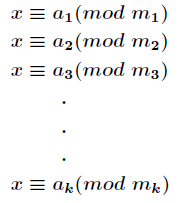
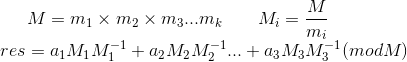

## 一、逆元
* 定义：对于两个互质的正整数a,m，同余方程`ax ≡ 1 (mod m)`恒成立，则满足该方程的最小正整数x称为a模m的逆元。
* 对于逆元问题，一般用拓展 **欧几里得算法** 求得。易知存在整数k使得方程`ax + km = 1`成立，则此时把x和k作为变量可用extgcd求出解系。实现如下：

```c++
void extgcd(int a,int b,int &x,int &y){

    b?(extgcd(b,a%b,y,x),y-=(a/b)*x):(x=1,y=0);
}
int ni(int a,int m){       //求a模m的逆元

    int x,y;
    extgcd(a,m,x,y);
    return (m+x%m)%m;
}
```

* 若m为质数，则根据 **费马小定理** 直接得出逆元为`a^(m-2)`，因为当m为质数时同余方程`a^(m-1) ≡ 1 (mod m)`恒成立。则利用 **费马小定理** 和 **快速幂取模** 可得到另一种逆元的求法：

```c++
int ni(int a, int m) {      //求a模m的逆元,m必须是素数

    int n = m - 2, res = 1;
    while (n) {
        if (n & 1) res = res * a % m;
        a = a * a % m;
        n >>= 1;
    }
    return res;
}
```

* 在求 **组合数**, **阶乘**, **拉朗日插值** 时需要用到逆元前n项表，用上述算法复杂度达到`O(nlogn)`显然不够理想，可以利用如下递推式打表，时间复杂度降到`O(n)`。


```c++
const int maxn = 1005;
int ni[maxn], mod;
void ini() {

    ni[1] = 1;
    for (int i = 2; i < maxn; i++)
        ni[i] = ni[mod % i] * (mod - mod / i) % mod;
}
```


* **经典问题**：易知`a|b`，求如下表达式的值：`x = (b/a) mod m`。
若a,m互质则可用extgcd算法，若m为质数则可用费马小定理，但这些解法都不具有普适性。现做如下推导：
1. 设整数k，满足`b/a = km + x (x<m)`，则有`b = kma + xa`。
2. 两边同时对am取模，则`b ≡ xa (mod am) `，即`xa = b mod (am)`。
3. 同时除以a，则`x = ( b mod (am) )/a`，即为所求解。

* **逆元在模运算中的应用** :若`a | b`，则`(a | b) mod m = ((a mod m) * (b^(-1) mod m)) mod m`，其中`b ^ (-1)`表示b模m的逆元。

## 二、约数和定理

* 定义：对于任意大于1正整数n可以分解质因数：`n=p1^a1*p2^a2*...*pk^ak`，其正约个数为`(a1+1)(a2+1)...(ak+1)`。那么n的正约数的和为`f(n) = (p1^0+p1^1+…p1^a1)(p2^0+p2^1+…p2^a2)…(pk^0+pk^1+…pk^ak）`。

以下给出求`t(p,n) = 1+p+p^2...+p^n`代码实现的推导：
1. 当数据很小，不用取模时 **（基本不会遇到，所以这条可以忽略 =_= ）** ，可以直接用等比数列的公式：`t(p,n) = ( pow(p,n+1)-1 )/( p-1 )`。
2. 若n为0，则显然该式为1。可以作为递归的返回条件，每次进行折半递归。
3. 若n为奇数，则原式有偶数项。则可以用分治的思想进行因式分解：`(1+p+p^2...+p^((n-1)/2) ) * (1+p^((n+1)/2) )`。
4. 若n为偶数，则可以先求出n-1奇数求和，然后加上p^n。即：`(1+p+p^2...+p^(n/2-1) ) * (1+p^(n/2) ) + p^n`。
5. 注意到除法是向下取整的，所以n为奇数时`(n-1)/2 == n/2`，n为偶数时`(n+1)/2 == n/2`，则化简后原式中偶数只比奇数时多了p^n。得出`t(p,n) = (1+p+p^2...+p^((n-1)/2) ) * (1+p^((n+1)/2) ) + (n&1)?0:p^n`，记得要  **模运算** 。

```c++
long long sum(long a,long long n){

    if(n == 0) return 1;
    long long t=sum(a,(n-1)/2),x=mod_pow(a,(n+1)/2);
    t=(t+t%mod*x%mod)%mod;
    if(n%2==0) t=(t+mod_pow(a,n))%mod;
    return t;
}
```
## 三、孙子定理（CRT）

<p style="text-align:center"></p>

* 定义：设正整数`m1,m2...mk互质`，则上述 **同余方程组** 有整数解，且在模`M=m1*m2*m3...mk`下的解唯一，解为`x ≡ a1M1(M1^-1)+a2M2(M2^-1)...+akMk(Mk^-1) (mod M)`，其中`Mi = M/mi`，`Mi^-1`为Mi模mi的 逆元。孙子定理又称 **中国剩余定理** 。




* 若Mi和mi互质，则其逆元可以直接用 **扩展欧几里德** 求解，调用`extgcd(Mi,mi,x,y)`后x即为逆元。

## 四、模板题（逆元）
<a href="http://poj.org/problem?id=1845">来源：poj #1845</a><br>
题目大意：给定整数x,n，求x^n约数和 mod 9901 。

```c++
#include<iostream>
using namespace std;
typedef long long LL;

const int maxn=1e4+5;
const int mod=9901;
int prime[maxn],n;

void init(){    //埃氏筛法枚举素数

    n=0;
    bool book[maxn]={};
    for(int i=2;i<maxn;i++)
        if(!book[i]){
            prime[n++]=i;
            for(int j=i+i;j<maxn;j+=i) book[j]=false;
        }
}
LL mod_pow(LL x,LL n){  //快速幂

    LL res=1;
    while(n>0){
        if(n&1) res=res*x%mod;
        x=x*x%mod;
        n>>=1;
    }
    return res;
}
LL sum(LL a,LL n){  //求出约数和的一项1+a+a^2...+a^n

    if(n == 0) return 1;
    LL t=sum(a,(n-1)/2),x=mod_pow(a,(n+1)/2);
    t=(t+t%mod*x%mod)%mod;
    if(n%2==0) t=(t+mod_pow(a,n))%mod;
    return t;
}
int main(){

    init();
    LL x,n;
    while(cin>>x>>n){
        LL res=1;
        for(int i=0;prime[i]*prime[i]<=x;i++)//分解合数
            if(x%prime[i]==0){
                int ct=0;
                while(x%prime[i]==0){
                    ct++;
                    x/=prime[i];
                }
                res*=sum(prime[i],ct*n)%mod;//更新约数和
                res%=mod;
            }
        if(x>1){    //处理该数是质数的情况
            res*=sum(x,n)%mod;
            res%=mod;
        }
        cout<<res<<endl;
    }

return 0;
}
```
## 五、模板题（孙子定理）
<a href="http://www.51nod.com/onlineJudge/questionCode.html#!problemId=1079">来源：51nod #1079</a><br>
题目大意：给定序列m和a分别表示模和余数，求满足模所有m等于相应的a的最小正整数。
```c++
#include<bits/stdc++.h>
using namespace std;
typedef long long LL;

const int maxn=15;
int n,a[maxn],m[maxn];

void extgcd(LL a,LL b,LL &x,LL &y){     //扩展欧几里德求逆元

    b?(extgcd(b,a%b,y,x),y-=(a/b)*x):(x=1,y=0);
}
LL crt(){   //孙子定理

    LL M=1,res=0,x,y;
    for(int i=0;i<n;i++) M*=m[i];
    for(int i=0;i<n;i++){
        LL mi=M/m[i];
        extgcd(mi,m[i],x,y);    //求mi的逆元
        res=(res+mi*x*a[i])%M;
    }
    if(res<0) res+=M;   //注意res<0的情况
    return res;
}
int main(){

    while(cin>>n){
        for(int i=0;i<n;i++) cin>>m[i]>>a[i];
        cout<<crt()<<endl;
    }

return 0;
}

```


