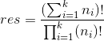
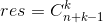
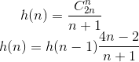

## 一、 组合数学
* **有重复元素的全排列**

    给定k个元素，第i个元素有ni个元素，则全排列的个数为：总个数和的阶乘（除以）各元素阶乘的积。
<br>

* **可重复选择的组合**

    给定n个不同元素，选出k个元素（可重复选），则选法个数为：
<br>

* **求组合数**

    1. **递推式**
        从n个数中选0个数有1种方案，然后利用如下递推公式，可得从n个数中选k个数的方案数：
        <br> 
    2.  **组合数打表**
        利用递推式`c[n][i]=c[n-1][i]+c[n-1][i-1]`打表：
```c++
const int maxn=1001;
const int mod=100;
int c[maxn][maxn];
void ini(){

    for(int n=0;n<maxn;n++){
        c[n][0]=c[n][n]=1;
        for(int i=1;i<n;i++)
            c[n][i]=(c[n-1][i]+c[n-1][i-1])%mod;
    }
}
```

## 二、Catalan数
令`h(0) = 1 , h(1) = 1`，则catalan数满足如下通项公式和递推公式：
<br>

其常见应用如下：
1. **出栈次序** `一个栈的进栈序列为1、2、3...n，求出栈序列的方案数。`
2. **括号匹配** `给定n对括号，求满足正确配对的字符串个数。`
3. **构成二叉树** `给定n个节点，求能构成的二叉树的方案数。`
4. **凸多边形三角划分** `给定凸的n边形，用n-3条不相交的对角线划分成n-2个三角形，求方案数。`

## 三、概率论
* **全概率公式**

    设事件组 `A1,A2...An`是样本空间`Ω`的一个划分，且两两互斥。则可以把事件B划分成n个小事件，将所有Ai发生情况下B发生的概率求和，即可求出B事件发生的概率。
    <br>

* **贝叶斯公式**

    在大事件B发生的情况下求Ai发生的原因，结果为Ai发生下B发生的概率除以所有A发生下B发生的概率，又称为后验概率。
    <br>

* **离散性数学期望**

    设随机变量x的取值为`x1,x2...xn`，对应取值概率为`p1,p2...pn`，则x的期望：
    <br>

* **连续型数学期望**
    设`f(x)`为随机变量x的概率密度函数，若积分绝对收敛，则x的期望：
    <br>


